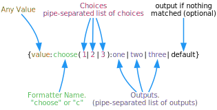

# Choose Formatter

Use the Choose Formatter to add logic to a Smart String by selecting an output, using a provided set of choices. To invoke the Choose Formatter explicitly, use the name "choose" or "c".

| **Example Smart String**                              | **Argument**  | **Result**  |
|-------------------------------------------------------|---------------|-------------|
| {0:choose(1\|2\|3):one\|two\|three\|other}            | 2             | two         |
| {0:choose(1\|2\|3):one\|two\|three\|other}            | 1             | one         |
| {0:choose(1\|2\|3):one\|two\|three\|other}            | 5             | other       |
| {0:choose(True\|False):yes\|no}                       | true          | yes         |
| {0:choose(null): NULL \| {} }                         | `null`        | NULL        |
| {0:choose(null): NULL \| {} }                         | "Hello World" | Hello World |
| How {0:choose(Male\|Female):is he\|is she\|are they}? | "Male"        | How is he?  |

- The value can be anything. It will be converted to string (using [ToString](https://docs.microsoft.com/en-us/dotnet/api/system.object.tostring)), and then matched against the choices. This works great for numbers, booleans, strings, enums, and most simple types.
- Choices are case-sensitive by default.
- `null` is supported too: `{0:choose(null): NULL | NOT NULL }`
