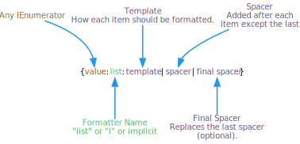

# List Formatter

The List Formatter is a Source and a Formatter. You can use it as a Formatter to repeat the contents of any [IEnumerable](https://docs.microsoft.com/en-us/dotnet/api/system.collections.ienumerable), such as an Array or List.

The spacers can also include character literals, for example, instead of a comma you could also use **\n** to list each item on a new line.
Use the placeholder index to access the current index of the list being iterated. You can use this to access multiple lists.

| **Example Smart String**                                                                          | **Arguments**                                                                        | **Result**                                                                                                       |
|---------------------------------------------------------------------------------------------------|--------------------------------------------------------------------------------------|------------------------------------------------------------------------------------------------------------------|
| {0:list:{}\|, \|, and }                                                                           | [!code-cs] | one, two, and three                                                                                              |
| {theKey:ismatch(^.+123.+$):Fixed content if match\|No match content}                              | [!code-cs] | Fixed content if match                                                                                           |
| {0:list:{:ismatch(^100\|200\|999$):{:0.00}\|'no match'}\|, \| and }                               | [!code-cs] | 100.00, 200.00 and 'no match'                                                                                    |
| {0:list:{:ismatch(^100\|200\|999$):'match'\|'no match'}\|, \| and }                               | [!code-cs] | 'match', 'match' and 'no match'                                                                                  |
| The index placeholder can be used to sync multiple lists such as:  {0:{} = {1.index}\|, } | [!code-cs] | The index placeholder can be used to sync multiple lists such as:  1 = one, 2 = two, 3 = three, 4 = four |
