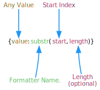

# Sub String Formatter

Use SubString Formatter to output parts of an input string. If the value is not a string it is first converted to one using the value’s ToString method.

| **Field** | **Description** |
| --------- | --------------- |
| **Parameter Delimiter** | The character used to separate the start and length value. By default it uses a comma. |
| **Null Display String** | The string to display if the string being formatter is null. |
| **Out Of Range Behavior** | Defines what to do if the substring position or length goes out of the range of the provided string.<ul><li>**Return Empty String** - Returns String.Empty.</li><li>**Return Start Index To End Of String** - Returns the remainder of the string starting at start index.</li><li>**Throw Exception** - Throws a FormattingException.</li></ul> |

| **Example Smart String**         | **Arguments**                                                                             | **Result**    |
|----------------------------------|-------------------------------------------------------------------------------------------|---------------|
| {0:substr(5)}                    | `"Long John"`                                                                             | John          |
| {0:substr(0, 3)}                 | `"New York"`                                                                              | New           |
| Hello {name:substr(1)} {surname} | [!code-cs] | Hello L Croft |
