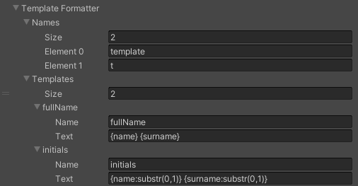

# Template Formatter

The Template Formatter lets you register reusable templates, and use them by name.
Templates are useful when you want to format text in a particular way across multiple smart strings. When the string needs to be modified, you only need to do it in the template.

| **Example Smart String**                 | **Arguments**                                                                            | **Result**           |
|------------------------------------------|------------------------------------------------------------------------------------------|----------------------|
| The initials are  {0:template(initials)} | [!code-cs] | The initials are L C |
| Hello {0.template(fullName)}             | [!code-cs] | Hello Lara Croft     |
